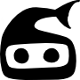

Ninjafish
=========

Control Ninja Block Devices from SailfishOS.

This is an early Alpha Version which may and will stop functioning when you least expect it. If you're not comfortable with building it yourself, you might be better off waiting for an official release.

What is working:
 - Log in
 - Set actuators
 - Set rgb(8)-LEDs
 - Hide devices from main interface
 - Add actuators/LEDs as favourite

What is not:
 - Usable cover
 - Everything else
